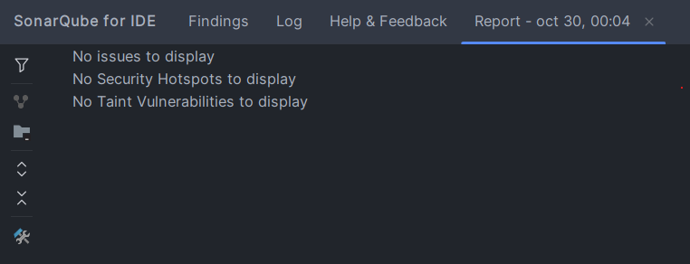

# 🏆 Sistema para Gestión de Votaciones

## 📝 Descripción del Proyecto

Este proyecto es la implementación de una **API REST** desarrollada con **Java y Spring Boot** para gestionar un sistema de votaciones a nivel local. El sistema permite registrar y administrar **Partidos Políticos**, **Candidatos**, y **Votos** emitidos, con un foco en la arquitectura limpia, la persistencia de datos con Spring Data JPA y la cobertura de pruebas.

El proyecto demuestra el dominio de los siguientes conceptos y tecnologías:

* **Persistencia:** Spring Data JPA con H2 (base de datos en memoria)
* **Modelado:** Relaciones `@ManyToOne` (Candidato ↔ Partido, Voto ↔ Candidato)
* **Testing:** Pruebas unitarias con JUnit 5 y Mockito
* **Documentación:** Swagger (OpenAPI) y Colección de Postman
* **Calidad de Código:** Análisis estático con SonarQube

---

## 🚀 Instrucciones de Ejecución

Sigue estos pasos para levantar la aplicación en tu entorno local.

### 1. Requisitos Previos

* **Java 17** o superior (OpenJDK recomendado)
* **Maven** (para gestión de dependencias)
* **SonarQube** (para análisis de calidad)

### 2. Clonar el Repositorio

Abre tu terminal y clona el proyecto:

```bash
git clone https://github.com/JosefinaOller/segunda-evaluacion.git
cd segunda-evaluacion
```

### 3. Compilación y Ejecución

La base de datos se implementa en memoria (H2).

Compila el proyecto usando Maven:

```bash
mvn clean install
```

Ejecuta la aplicación Spring Boot:

```bash
mvn spring-boot:run
```

La API estará disponible en `http://localhost:8080`.


---

## 🧪 Datos de Prueba Iniciales (Postman Collection)

Para probar todos los endpoints, se recomienda importar la colección de Postman proporcionada, que contiene ejemplos de request y response para cada endpoint.

| Entidad | Tipo de Datos | Descripción                                                                        |
|---------|---------------|------------------------------------------------------------------------------------|
| Partidos Políticos | JSON | Datos válidos para creación de partidos (ej: MAD, UA, UM)                          |
| Candidatos | JSON | Nombres de candidatos y referencias a los partidos creados                         |
| Votos | JSON | Ejemplos para registrar votos válidos para cada candidato, incluyendo fechaEmision |

### 📁 Ubicación de la Colección

La colección de Postman exportada se encuentra en el directorio:

```
docs/postman/Sistema para Gestión de Votaciones.postman_collection
```

---

## 💻 Endpoints y Documentación

### Endpoints REST Principales

| Recurso | Método | Ruta | Descripción |
|---------|--------|------|-------------|
| Partidos Políticos | POST / GET / DELETE | `/api/partidos` | Gestión completa de partidos políticos |
| Candidatos | POST / GET / DELETE | `/api/candidatos` | Gestión completa de candidatos |
| Votos (Registro) | POST | `/api/votos` | Registra un voto para un candidato específico |
| Votos (Consulta) | GET | `/api/votos/candidato/{id}` | Consulta total de votos por candidato |
| Votos (Consulta) | GET | `/api/votos/partido/{id}` | Consulta total de votos por partido |

### Documentación con Swagger / OpenAPI

Para ver la documentación interactiva de la API, accede a la siguiente URL cuando la aplicación esté en ejecución:

```
http://localhost:8080/swagger-ui.html
```

---

## 🛡️ Análisis de Calidad y Testing

### SonarLint Analysis

Se utilizó la herramienta **SonarLint** para realizar un análisis estático del código, asegurando el cumplimiento de convenciones de codificación limpia y buenas prácticas. El análisis incluye:

- **Cobertura de código** y calidad del testing
- **Detección de bugs** y vulnerabilidades potenciales
- **Code smells** y deuda técnica
- **Cumplimiento de estándares** de codificación

La siguiente captura de pantalla de confirma que el proyecto cumple con los estándares de calidad establecidos:

**


### Pruebas Unitarias

El proyecto incluye pruebas unitarias robustas con JUnit 5 y Mockito en las capas de Servicios, Controladores, Repositorios y Modelos, asegurando una alta cobertura y la correcta implementación de la lógica de negocio.